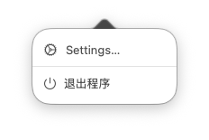
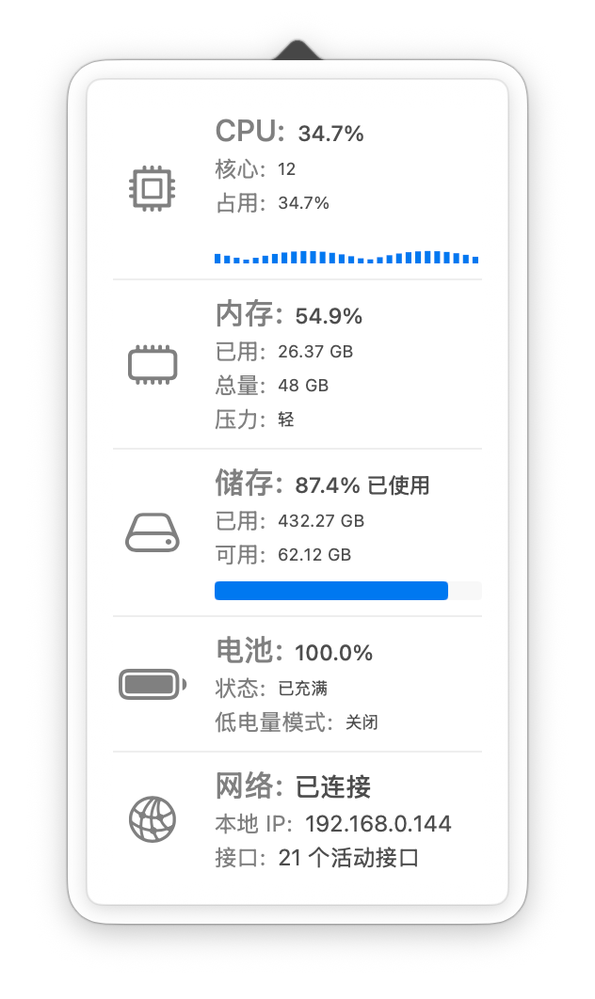
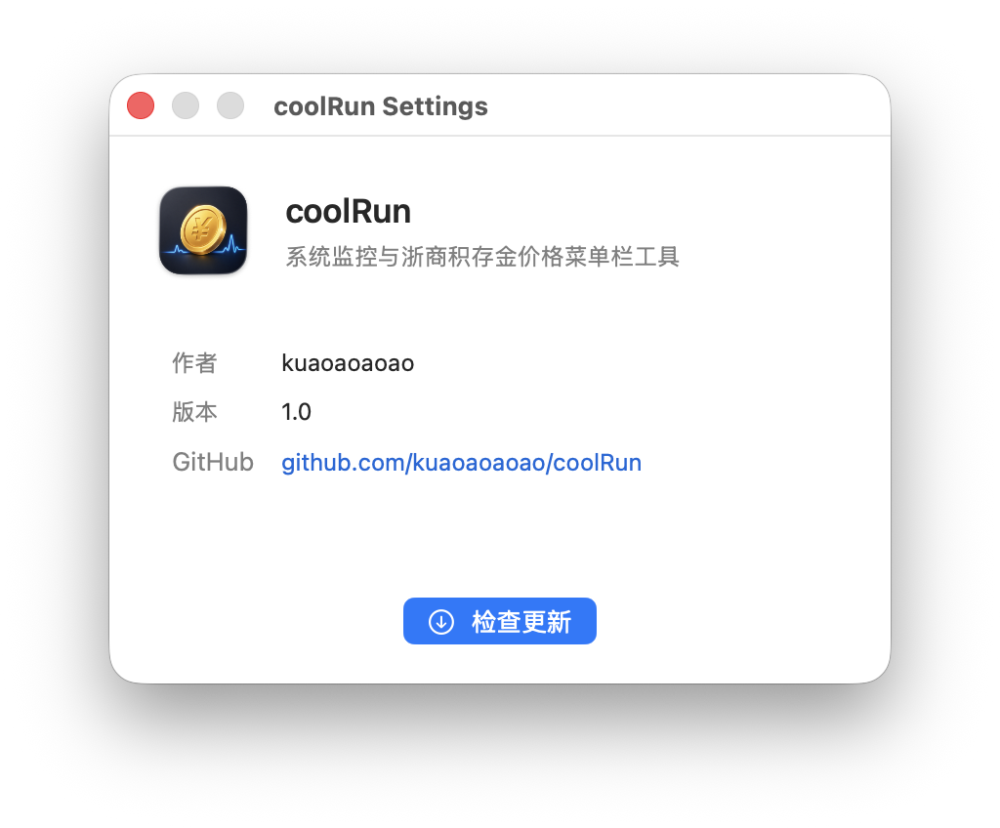

# coolRun

coolRun 是一款轻量的 macOS 菜单栏系统监控工具。它可以在菜单栏实时显示浙商银行积存金价格，并通过一个会随 CPU 占用加速旋转的金币图标，让你快速感知当前电脑负载。

点击菜单栏图标即可查看 CPU、内存、储存、电池和网络状态。右键图标可以打开设置或退出应用。

官网：[kuaoaoaoao.github.io/coolRun](https://kuaoaoaoao.github.io/coolRun/)

## Star History

[](https://star-history.com/#kuaoaoaoao/coolRun&Date)

## 功能特性

- 菜单栏常驻
  - 不占用桌面空间，默认以菜单栏应用形式运行。
  - 菜单栏显示实时金价，格式为 `¥xxx.xx/g`。
  - 金币图标会根据 CPU 占用动态旋转，负载越高旋转越快。

- 系统监控
  - CPU：核心数、实时占用、动态占用条。
  - 内存：已用内存、总内存、内存压力。
  - 储存：已用空间、可用空间、使用进度。
  - 电池：电量、充电状态、低电量模式。
  - 网络：连接状态、本地 IP、活动接口数量。

- 金价查询
  - 查询浙商银行积存金价格。
  - 以人民币/克展示。
  - 不需要用户填写 API Key。

- 设置页面
  - 查看应用信息、作者和当前版本。
  - 一键打开 GitHub 项目主页。
  - 一键打开 GitHub Releases 下载新版本。

- 深色模式
  - 使用 macOS 系统自适应颜色。
  - 支持浅色模式和深色模式。

## 界面预览

<table>
  <tr>
    <td align="center">
      
      <br>
      <sub>菜单栏金价</sub>
    </td>
    <td align="center">
      
      <br>
      <sub>右键快捷菜单</sub>
    </td>
  </tr>
  <tr>
    <td align="center">
      
      <br>
      <sub>系统监控面板</sub>
    </td>
    <td align="center">
      
      <br>
      <sub>设置页面</sub>
    </td>
  </tr>
</table>

## 安装方式

### 从 GitHub Releases 安装

1. 打开 [GitHub Releases](https://github.com/kuaoaoaoao/coolRun/releases)。
2. 下载最新版本的 `coolRun.dmg` 或 `coolRun.zip`。
3. 如果是 DMG，双击打开后将 `coolRun.app` 拖入 `Applications` 文件夹。
4. 启动 `coolRun`。
5. 启动后在 macOS 菜单栏找到金币图标。

如果 macOS 提示“无法验证开发者”，可以右键点击 `coolRun.app`，选择“打开”，再在弹窗中确认打开。

如果打开 app 时提示“文件已损坏”，这是因为 coolRun 目前未经过 Apple 公证，macOS 会阻止打开。安装后在终端执行：

```bash
sudo xattr -cr /Applications/coolRun.app
```

## 使用方式

- 左键点击菜单栏金币图标：打开或关闭系统监控面板。
- 点击其他位置：自动隐藏系统监控面板。
- 右键点击菜单栏金币图标：打开快捷菜单。
- 在快捷菜单中点击“设置”：打开设置页面。
- 在快捷菜单中点击“退出程序”：退出 coolRun。

设置页面中的“前往下载”会打开 GitHub Releases，用户可以下载新版安装包并替换旧版本。

## 从源码运行

### 环境要求

- macOS
- Xcode
- Swift / SwiftUI

### 运行项目

1. 克隆项目：

   ```bash
   git clone https://github.com/kuaoaoaoao/coolRun.git
   cd coolRun
   ```

2. 使用 Xcode 打开：

   ```bash
   open coolRun.xcodeproj
   ```

3. 选择 `coolRun` scheme。
4. 运行目标选择 `My Mac`。
5. 点击运行。

## 打包发布

### 使用 Xcode 导出 App

1. 使用 Xcode 打开 `coolRun.xcodeproj`。
2. 选择菜单栏：

   ```text
   Product > Archive
   ```

3. Archive 完成后，在 Organizer 中导出 `coolRun.app`。

### 制作 DMG

项目提供了 DMG 打包脚本：

```bash
./scripts/create-dmg.sh
```

也可以手动指定 app 路径：

```bash
./scripts/create-dmg.sh /path/to/coolRun.app
```

脚本会在项目根目录生成 `coolRun.dmg`。

### 发布到 GitHub Releases

1. 修改版本号。
2. 使用 Xcode Archive 导出应用。
3. 运行 `scripts/create-dmg.sh` 制作安装包。
4. 在 GitHub 创建新的 Tag，例如：

   ```text
   v1.0.1
   ```

5. 创建 Release。
6. 上传 `coolRun.dmg` 或 `coolRun.zip`。

## 金价数据说明

当前金价来源：

```text
https://api.jdjygold.com/gw2/generic/produTools/h5/m/getGoldPrice?goldCode=CZB-JCJ
```

应用会读取接口返回值中的：

```text
resultData.data.lastPrice
```

并展示为：

```text
¥973.24/g
```

金价接口由第三方提供，稳定性和数据准确性取决于接口服务方。coolRun 仅展示接口返回数据，不构成投资建议。

## 项目结构

```text
coolRun
├── coolRun.xcodeproj
├── coolRun
│   ├── coolRunApp.swift
│   ├── MacAppDelegate.swift
│   ├── ContentView.swift
│   ├── MenuBarMonitorView.swift
│   ├── SettingsView.swift
│   ├── GoldPriceService.swift
│   ├── SystemMonitorViewModel.swift
│   ├── SystemSampler.swift
│   ├── SystemMetrics.swift
│   ├── AppVersion.swift
│   ├── coolRun.entitlements
│   └── Assets.xcassets
├── scripts
│   └── create-dmg.sh
├── README.md
└── LICENSE
```

主要文件说明：

- `coolRunApp.swift`：应用入口。
- `MacAppDelegate.swift`：菜单栏图标、金币动画、弹窗、右键菜单和金价刷新。
- `ContentView.swift`：系统监控面板 UI。
- `MenuBarMonitorView.swift`：菜单栏弹窗中的监控视图。
- `SettingsView.swift`：设置页面。
- `GoldPriceService.swift`：金价接口请求与解析。
- `SystemSampler.swift`：系统数据采样。
- `SystemMonitorViewModel.swift`：系统监控状态刷新。
- `SystemMetrics.swift`：系统监控数据模型。
- `scripts/create-dmg.sh`：DMG 打包脚本。

## 隐私说明

coolRun 不收集用户隐私数据，不上传系统监控信息。

应用会发起网络请求获取金价数据，请求目标为金价接口服务方。系统状态数据仅在本机采样并展示。

## 贡献

欢迎提交 Issue 和 Pull Request。

可以改进的方向：

- 更多菜单栏显示样式。
- 自定义金价刷新频率。
- 更多贵金属或自定义数据源。
- 更完善的自动更新能力。
- 更漂亮的图标和动画效果。

## 许可证

本项目基于 MIT License 开源，详见 [LICENSE](./LICENSE)。

## 作者

- 作者：kuaoaoaoao
- GitHub：[github.com/kuaoaoaoao/coolRun](https://github.com/kuaoaoaoao/coolRun)
